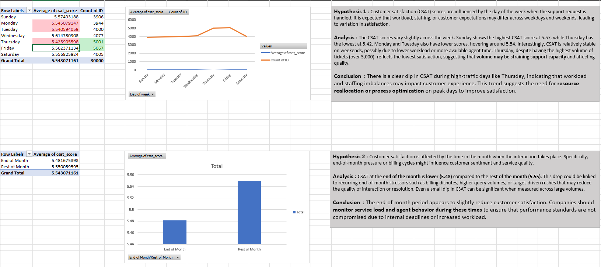
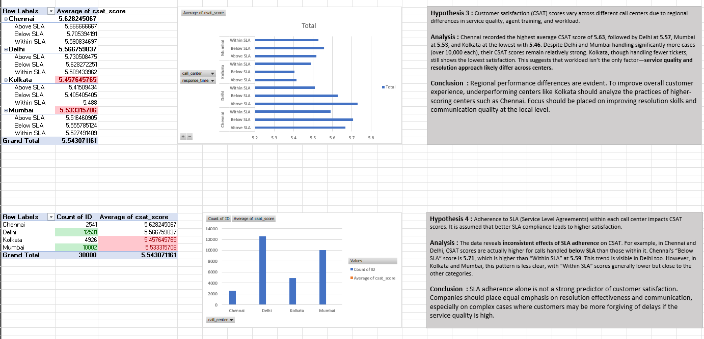
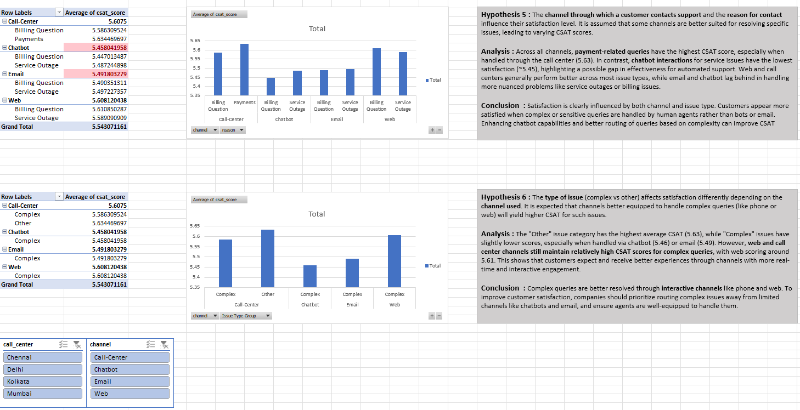
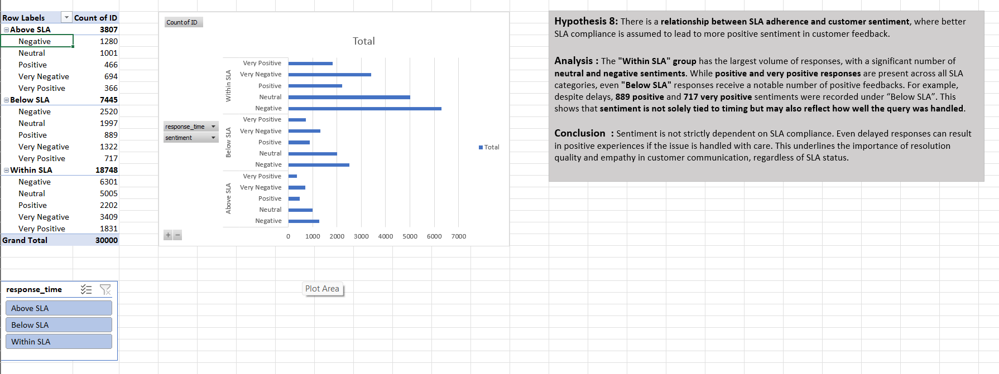
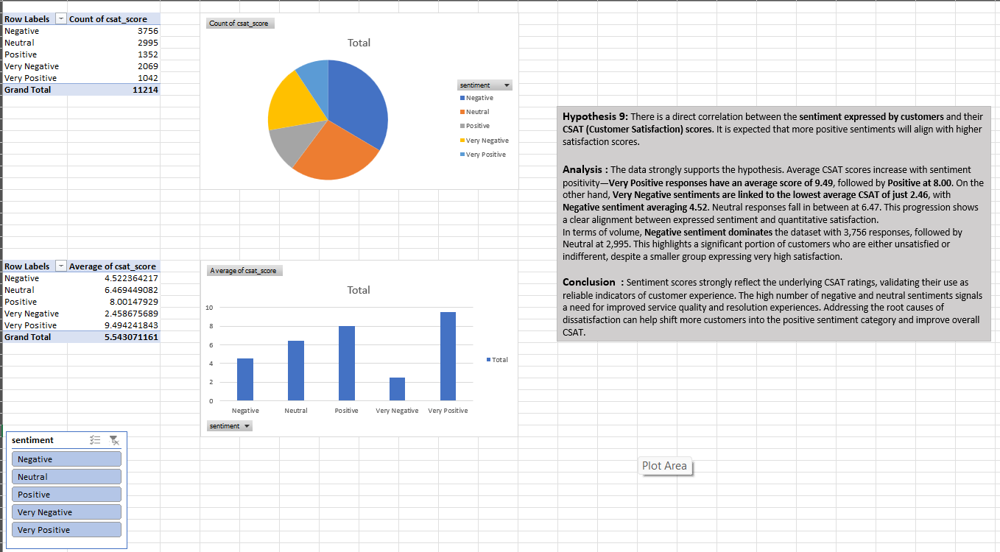

# 🛍️ Flipkart Customer Support Data Analysis (Excel)

### 📊 Comprehensive Performance Analysis of Flipkart’s Customer Service Operations  

This project uses **Microsoft Excel** to analyze Flipkart’s customer support data — revealing insights into **response times, service quality, regional efficiency, and customer sentiment**.  
Through structured analysis sheets and an integrated dashboard, the project provides a complete view of performance metrics and business insights.

---

## 🗂️ Excel Workbook Overview  

### **1. DATA**
- Contains the **raw dataset** of customer service tickets.  
- Columns include: `Ticket ID`, `Customer ID`, `State`, `Issue Type`, `Channel`, `Date`, `Response Time`, `SLA Status`, `Customer Sentiment`.  
- Acts as the foundational data source for all analyses.  

### **2. Time Based Performance**
- Evaluates **ticket trends and performance over time** (daily, weekly, monthly).  
- Tracks **response efficiency**, **SLA compliance**, and **issue volume variation**.  
- Helps identify patterns in **customer service workload** and **resolution delays**.  

### **3. Call Centre Performance**
- Focuses on analyzing **call support performance** metrics.  
- Includes details such as **calls handled**, **average call duration**, and **resolution rate**.  
- Highlights **high-performing agents** and **peak activity periods** to assess efficiency.  

### **4. Channel Effectiveness**
- Compares performance across **customer communication channels** like App, Email, Call, and Chat.  
- Tracks key metrics including **Response Time**, **Resolution Rate**, and **Customer Satisfaction Score**.  
- Provides insights to **optimize resource allocation** and improve service consistency across channels.  

### **5. SLA and Response Time**
- Measures **Service Level Agreement (SLA)** compliance and **response efficiency** across all tickets.  
- Displays key metrics such as **SLA Met %**, **Average Response Time**, and **Breach Count**.  
- Identifies bottlenecks and delays that impact timely **issue resolution** and **customer satisfaction**.  

### **6. Sentiment Analysis**
- Analyzes **customer feedback** to classify sentiment as **Positive**, **Neutral**, or **Negative**.  
- Visualizes sentiment distribution across **issue types**, **channels**, and **regions**.  
- Helps monitor **customer satisfaction trends** and identify areas needing service improvement.  

### **7. Statewise Analysis**
- Provides a **regional breakdown** of customer service performance by **state**.  
- Tracks key indicators such as **ticket volume**, **average response time**, and **SLA compliance rate**.  
- Highlights **top-performing regions** and identifies **areas with higher complaint frequency**.  
- Supports data-driven decisions for improving **regional operations and resource allocation**.  

### **8. Dashboard**
- Consolidates all key insights into a **single interactive Excel dashboard**.  
- Displays **KPIs**, **charts**, and **slicers** for dynamic filtering by issue type, channel, and region.  
- Offers a quick, visual overview of **overall performance metrics** and **customer experience trends**.  
- Designed for **management reporting** and easy interpretation of operational data.  
